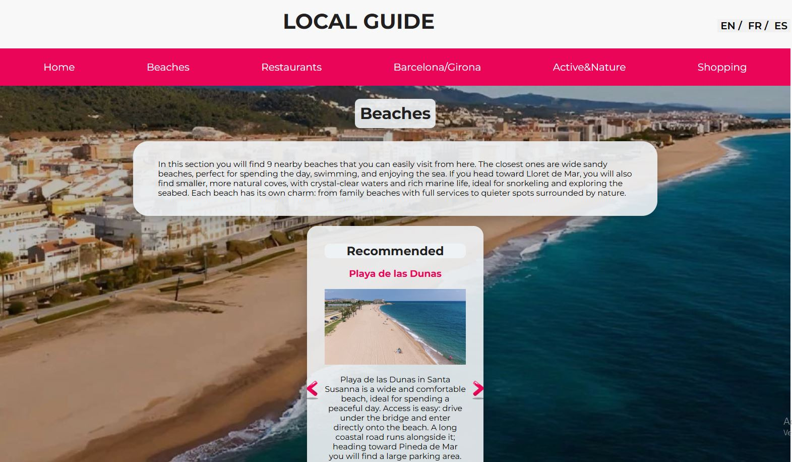

# Local Guide with Redux

## Demo  
🔗 View the app on Netlify (https://local-guide-redux.netlify.app)

## Project Description

**Local Guide with Redux** is a React application created to help tourists visiting our town.  
The app provides a curated list of useful local places and attractions, making it easier for visitors to navigate the area and discover important locations.

Tourists can find information about:
- Supermarkets
- Waste container locations
- Beaches
- Restaurants
- Top attractions in Barcelona and Girona
- Local attractions and places of interest
- Large shopping malls

The project is built using **React** and includes several modern web development features.

Project implementation includes:
- Data stored in separate files as arrays
- **React Router** for navigation and page routing
- Rendering attraction cards using the `.map()` method
- **Filtering cards by categories using Redux and the `.filter()` method**
- A **Top-3 must-visit places slider**
- **Multilingual support** using `react-i18next` and the `useTranslation` hook
- **Responsive design** optimized for mobile devices

No installation is required.

## Here's what the app looks like:

## How to Use:
- Navigate between sections using the menu.
- Explore different categories of places in the town.
- Click category buttons to filter locations.
- Use the slider to see the **Top-3 recommended places to visit**.
- Switch the interface language if needed.

## Features:
- Tourist-friendly guide for local places and attractions
- Category filtering for locations
- Dynamic card rendering using `.map()`
- Client-side routing with React Router
- Internationalization with `react-i18next`
- Top attractions slider
- Mobile responsive design
- Organized data structure using arrays

## Requirements:
- A modern web browser
- JavaScript enabled

## Technologies Used
- React
- Redux
- Vite
- React Router
- i18next (react-i18next)
- JavaScript (ES6+)
- CSS